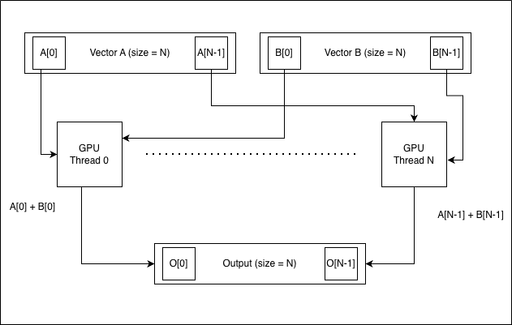

# 벡터 합 예제

이 예제에서는 두 개의 벡터를 더하는 방법을 보여줍니다.  
n개의 차원을 가진 두 float32 벡터 A와 B가 주어졌을 때, 이들의 합 벡터 C는 각 차원에서 대응하는 성분을 더하여 계산됩니다. 즉, C[i] = A[i] + B[i] (0 ≤ i < n) 입니다.  
이를 위해 output[i] 를 계산하기 위해 하나의 GPU 스레드를 사용합니다.

이 예제에서는 GPU의 최대 스레드 수 이하의 벡터 크기를 가정합니다.

## 알고리즘

Output의 각 원소 O\[i] 에 대해 한개의 GPU 스레드가 작업을 수행합니다.
O\[i] = A\[i] + B\[i]

# 구현 예제
| CUDA | OpenCL |
|------|--------|
| [CUDA 코드 보기](CUDA/main.cu) | [OpenCL 코드 보기](OpenCL/main.cpp) |
---

